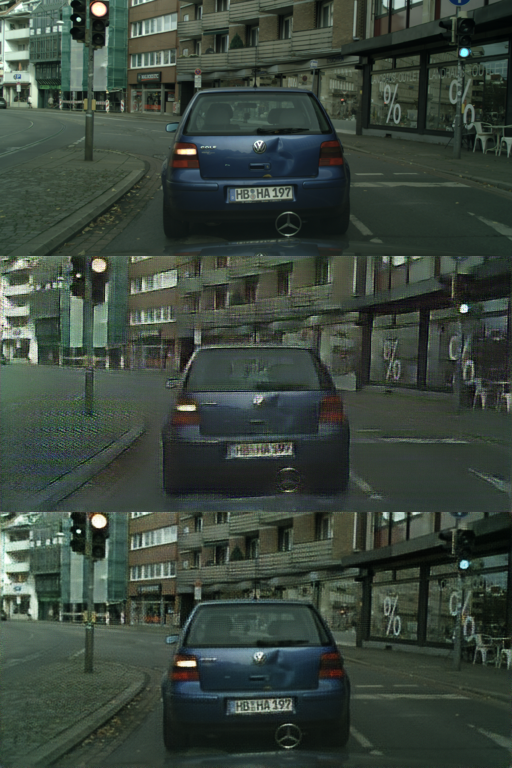
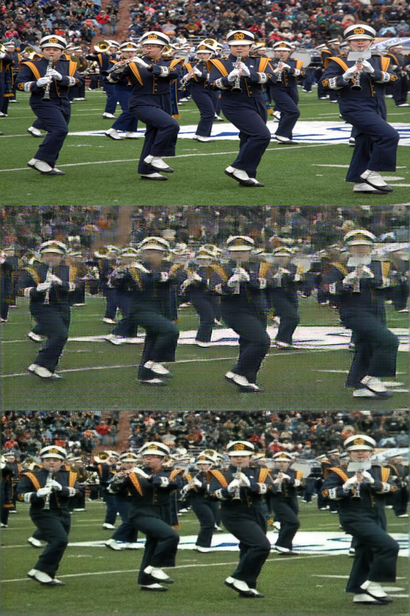
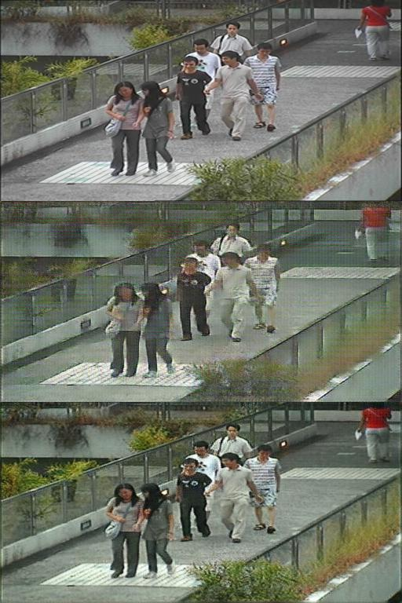

#secStudent使用说明
## 环境安装
我们所使用的环境是conda虚拟环境，里面的pip包和conda已经全部打包到根目录，分别是**conda_env.yaml**和**pip_requirements.txt**安装命令如下:

`conda env create -f conda_env.yaml`

`pip install -r pip_requirements.txt`

##  文件目录结构
- data_processing 数据预处理
- images 图片输入输出
- loss_utils 各类函数
- model 模型
- saved_key 密匙存放
- saved_models 模型权重存放

## 模型训练
- 将离线处理后的数据集置入 images/dataset ，
- 根据需求运行 train_hinet.py 或者 train_LBU.py
- 用于训练的可视化的测试样例会输出保存到 images/(your_dataset_name) 如 images/cartoonCity_hinet_dataset_256w_key
- 训练的权重会保存到 saved_models/(your_dataset_name) 如 saved_models/cartoonCity_hinet_dataset_256w_key
- 密匙key将会被随机生成同时保存到 saved_key 文件夹里，名称已预设置为 keytest.pth
- saved_models权重下载地址：链接:https://pan.baidu.com/s/1EU4jlVc5bHo-Te7DksFzqw 
  提取码:yyds

##  测试模型
- 本作品已经有两个训练好的模型权重在saved_models文件夹里供预览使用，分别为HINET和LBU模型的权重，G_AB_99.pth为生成器的权重，G_BA_99.pth为解码器的权重
- 供快速测试的样例图片存放在 images/input_images 有两类，车辆 images/input_images/car ，行人 images/input_images/people
- 运行 test_LBU.py 或 test_hinet.py
- 图片默认输出到 images/output_images，效果如下所示

### bluecar

### Parade

### People206

